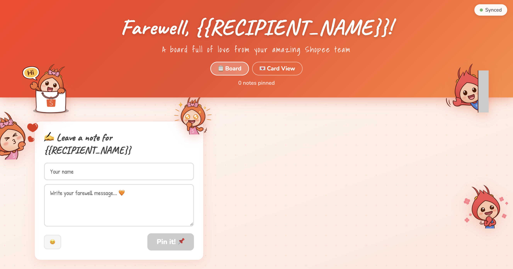

# 💌 Farewell Card

A collaborative farewell card where your whole team can pin sticky-note goodbyes on a shared board — synced live for everyone, deployed on free hosting in minutes.

### ▶️ [**Try the live demo →**](https://farewell-card.jiayilee.workers.dev/)

See a real deployed card in action before you make your own.

> ⭐ **If this helps you say a nice goodbye, please star the repo** — it's the easiest way to say thanks and helps other teams find it.

🍊 Original theme 


🏖️ Beach theme 
 
<sub>Toggle between the two built-in themes any time with the 🍊 / 🏖️ switch in the corner.</sub>

---

## ✨ Why you'll love this

This isn't just a card — it's a **complete, deployable full-stack app you can own end-to-end**:

- 🎨 **A polished frontend** — vanilla HTML/CSS/JS with theming (🍊 original / 🏖️ beach), handwriting fonts, emoji reactions, replies, confetti, and milestone toasts. **No build framework to learn.**
- ⚙️ **A real backend** — an edge function that proxies storage, caches reads, and keeps your API keys **server-side** (never in the browser).
- 🌐 **Free web hosting** — HTTPS and hardened security headers out of the box.

Use it two ways:

1. **Send a heartfelt goodbye** your whole team can sign in seconds.
2. **Learn full-stack by shipping something real** — it's ~600 lines of approachable code that shows how *frontend → API → storage → deploy* fit together. A great first deployed full-stack project, minus the boilerplate.

You can build and deploy the whole thing **from your web browser** — no terminal required.

---

## 🚀 Make your own card (Getting Started)

> 🖱️ **Never used a terminal?** Just follow the 🖱️ steps — you can do everything from your browser.
> ⌨️ Prefer the command line? Follow the ⌨️ steps instead.

<details>
<summary>📦 <strong>Are you publishing this as a template for your team?</strong> (one-time maintainer setup)</summary>

If you're the person sharing this repo so colleagues can make their own cards:

1. **Create a public repo** — 🖱️ github.com → **New repository** → name it (e.g. `farewell-card`) → **Public** → Create. Then push this project to it.
2. **Turn on the template flag** so everyone sees a green **“Use this template”** button:
   - 🖱️ Repo → **Settings** → tick **“Template repository”**, or
   - ⌨️ `gh repo edit <owner>/farewell-card --template`
3. (Optional) Add a repo **description** and **topics** (`farewell`, `template`, `cloudflare-workers`) so it's easy to find.

That's it — colleagues now follow the numbered steps below to spin up their own copy.

</details>

### Step 1 — Get your own copy

- 🖱️ Click the green **“Use this template” → “Create a new repository”** button at the top of this repo, give it a name, and click **Create**. *(Recommended — you get your own independent repo with a clean history.)*
- ⌨️ Or `git clone https://github.com/jxxyx-bloop/farewell-card.git` for local work.
- 🔁 *Only fork* if you intend to improve the template itself and open a pull request back.

### Step 2 — Personalize

`config.js` is the **only file you edit** for basic use:

```js
window.CARD_CONFIG = {
  recipientName: "Alex",                          // who it's for
  subtitle: "A board full of love from your team",
  composePrompt: "Leave a note for",              // → "Leave a note for Alex"
};
```

- 🖱️ In your new repo on GitHub, open `config.js` → click the ✏️ pencil → edit the values → **Commit changes**.
- ⌨️ Or edit `config.js` in your editor and push.

### Step 3 — Create a free storage bin (all in the browser)

Notes are stored in [JSONBin.io](https://jsonbin.io) (free tier is plenty):

1. **Sign up** at jsonbin.io.
2. **Create Bin** → set the content to exactly `{"notes":[]}` → **Save**.
3. Copy the **Bin ID** (shown in the bin's URL / header).
4. Open **Account → API Keys** and copy your **X-Access-Key**.

Keep those two values handy for the next step.

### Step 4 — Deploy

See [Hosting](#-hosting-why-cloudflare) below for why Cloudflare is recommended. Either path gives you a public `*.workers.dev` URL:

- 🖱️ **Cloudflare dashboard (no terminal):**
  1. Go to [dash.cloudflare.com](https://dash.cloudflare.com) → **Workers & Pages → Create → Workers**.
  2. **Connect to Git** and pick your repo.
  3. After it deploys, open the worker's **Settings → Variables and Secrets** and add two **encrypted secrets**:
     - `JSONBIN_BIN_ID` → your Bin ID from Step 3
     - `JSONBIN_API_KEY` → your X-Access-Key from Step 3
  4. Redeploy.
- ⌨️ **Command line (Wrangler):**
  ```bash
  npm install -g wrangler
  wrangler login
  wrangler secret put JSONBIN_BIN_ID     # paste your Bin ID
  wrangler secret put JSONBIN_API_KEY    # paste your X-Access-Key
  node build.js && wrangler deploy
  ```

### Step 5 — Share 🎉

Send the public URL to your team and watch the notes roll in.

---

## 🖥️ Run it locally

```bash
cp config.example.js .dev.vars      # create your local secrets file (git-ignored)
# edit .dev.vars and fill in JSONBIN_BIN_ID and JSONBIN_API_KEY
node build.js && wrangler dev       # → http://localhost:8787
```

Opening `index.html` directly as a `file://` URL shows **mock data** (no backend in that context) — handy for previewing the look without any setup.

---

## 🌐 Hosting: why Cloudflare

**Cloudflare Workers is the recommended host**, and the choice is deliberate:

- 🌏 **Reachable for China-based colleagues.** Cloudflare's global edge network typically serves mainland-China visitors via its **Hong Kong PoP**, so the deployed card tends to stay accessible for teammates in China — where many Western-hosted sites are not. For a cross-region team, this is the headline advantage.
- 🔒 **Keys stay server-side.** The Worker holds your JSONBin credentials as **encrypted secrets** — they never reach the browser or get committed to git.
- ⚡ **Edge caching.** Reads are cached for 30 seconds at the edge, so a flood of simultaneous signers costs roughly **one** JSONBin API call.
- 🆓 **Free tier with HTTPS** and hardened security headers built in.

### Prefer Vercel? It works too

You can host on Vercel by swapping the Cloudflare Worker for a Vercel **Serverless Function**:

1. **Add `api/notes.js`** — a Vercel function that mirrors [`src/worker.js`](src/worker.js): handle `GET`/`PUT` on `/api/notes`, proxy to JSONBin with the `X-Access-Key` header, and read the keys from `process.env`.
2. 🖱️ **In the Vercel dashboard:** [vercel.com](https://vercel.com) → **Add New → Project → Import** your GitHub repo → under **Settings → Environment Variables** add `JSONBIN_BIN_ID` and `JSONBIN_API_KEY` (never in source) → **Deploy**.
3. **Add a `vercel.json`** that serves the static files and **includes the same security headers** as the Worker (`Strict-Transport-Security`, `Content-Security-Policy`, `X-Frame-Options: DENY`, `Referrer-Policy: no-referrer`, `X-Content-Type-Options: nosniff`, `Permissions-Policy`). Don't ship weaker headers.
4. For caching, set `Cache-Control: public, max-age=30` on the function's GET response.

> ⚠️ **Trade-off:** Vercel is simple and popular, but **verify reachability for any China-based recipients before relying on it** — that's exactly why Cloudflare is the default here.

---

## 🎛️ Customize further

Everything is yours to rebrand — mascots, colours, copy, even the team name. Here's a variation one team built from this template, with their own characters and branding:



> _The mascots and branding in the example above belong to their respective owners and are **not** part of this template — they're just a showcase of what you can build on top of it. The template ships with the red-panda mascot set._

| Want to change… | Edit… |
|---|---|
| Recipient name, subtitle, prompt | `config.js` |
| Note colors, emoji set, fonts | the `STICKY_COLORS` / `EMOJIS` / `FONTS` arrays in `app.js` |
| Themes, layout, animations | `style.css` |
| Mascot illustrations | swap the art in `assets/` — see [`assets/README.md`](assets/README.md). The 🍊 theme uses the bundled `mascot-*.png` red-panda set; the 🏖️ theme uses the bundled `prawn-*.png` set. A missing mascot is hidden automatically, so partial sets are fine. |

---

## 🏗️ Architecture

```text
config.js            Your card settings (recipient name, subtitle, prompt)
index.html           HTML structure only; no inline CSS or JS
style.css            Layout, animations, and responsive styles
app.js               Application logic, sync, rendering, and interactions
src/worker.js        Cloudflare Worker — caches JSONBin reads, keeps secrets server-side
build.js             Copies source files into public/ (no env vars needed)
package.json         Build script + project metadata
wrangler.jsonc       Cloudflare Worker + static assets configuration
config.example.js    Reference for local development secrets (copy to .dev.vars)
```

The browser talks to the Worker at `/api/notes`. The Worker holds the JSONBin credentials as encrypted secrets and caches read responses for 30 seconds, so multiple simultaneous page loads cost only one JSONBin API call.

## 🎉 Features

- Pin sticky notes with messages and author names
- Random pastel colors and handwriting fonts per note
- Beach theme toggle (🍊/🏖️) in the sync status pill
- Emoji reactions and short replies on notes
- Multi-user sync — board refreshes every 60 seconds
- Edit and delete notes created from the same browser session
- Keyboard shortcut: Cmd/Ctrl+Enter to pin a note
- Confetti animation + milestone toasts

## 🔐 Security

| Concern | Mitigation |
|---|---|
| API keys in source control | Credentials are Cloudflare Worker secrets — never committed to git or sent to browsers. |
| XSS via message or author | All user text is escaped with `escapeHtml()` before rendering. |
| Style injection | Rotation values are cast to numbers before use in inline styles. |
| Security headers | Served by the Worker on every response (HSTS, CSP, X-Frame-Options, etc.). |

See [SECURITY.md](SECURITY.md) for details and how to report a vulnerability.

## 🤝 Contributing

Contributions are welcome! See [CONTRIBUTING.md](CONTRIBUTING.md) and our [Code of Conduct](CODE_OF_CONDUCT.md).

## 📄 License

[Apache License 2.0](LICENSE).
